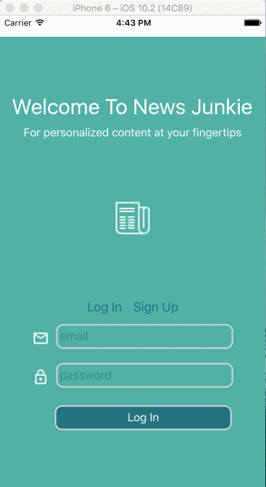

# News Junkie
## News Junkie for 2017 Impact Hackathon (2nd Place)

## Architecture and Technologies

This project was implemented with the following technologies:
* `React Native` and `JavaScript` for native mobile development and overall structure
* `Firebase API` for user authorization and database management
* `Expo` boilerplates for faster and less error-prone development

## About

News Junkie is a mobile News application that serves curated content to users using the Cognik API. Upon user creation, a unique profile is registered with Cognik that is used to develop recommendations as the user interacts with the platform. Users have the ability to like and dismiss content based on their interests. Based on user actions and activity, we dispatch this information to the Cognik API in order to develop a full profile and content recommendations the user enjoys.




## User Registration and Authorization

```javascript
submitInfo() {
  // SUBMIT REQUEST TO BACKEND AND PASS USER INFO ALONG
  // USER TOKEN && ACCOUNT TOKEN

  if (this.state.formType === 'Sign Up'){
    this.getAccountKey().then((response) => {
      if (response){
        firebaseApp.auth().createUserWithEmailAndPassword(this.state.email, this.state.password)
        .then((response) => {
          console.log("Sign up successful")
          this.setState({profile_id: response.uid})
          this.registerProfile()
        })
        .catch(function(error){
         var errorCode = error.code
         var errorMessage = error.message;
         console.log(errorMessage)
        })
      }
    })
  } else if (this.state.formType === 'Log In'){
    firebaseApp.auth().signInWithEmailAndPassword(this.state.email, this.state.password)
    .then((response) => {
      console.log("Log in successful")
      this.setState({profile_id: response.uid})
      this.getAccountKey2()
      //REDIRECT TO FEED
    })
    .catch(function(error) {

    var errorCode = error.code;
    var errorMessage = error.message;
    console.log(errorMessage)
    });
  }

}
```

## Profile Registration

```javascript
registerProfile(){
  fetch(`http://raas-se-prod.cognik.us/v1/accounts/hackathon04/profiles/${this.state.profile_id}`, {
    method: 'POST',
    headers: {
      'Accept': 'application/json',
      'Content-Type': 'application/json',
      'x-platform-id': 'phone',
      'x-app-token': this.state.accountToken
    },
    body: JSON.stringify({})
  }).then ((response)=> response.json())
    .then(() => Actions.feed({
        profile_id: this.state.profile_id,
        token: this.state.accountToken
      })
    )
    .catch((error) => {
      console.log(error);
    })
  }  
```

## Content Discovery and Personalized Recommendations

```javascript
export const sendImpression = ({
    profile_id,
    token,
    type,
    content_id,
    reco_id,
    percentage_viewed,
    duration_viewed
  }) => {
    return fetch(`http://raas-se-prod.cognik.us/v1/accounts/hackathon04/profiles/${profile_id}/actions`,

    {
      method: 'POST',
      headers: {
        'Content-Type': 'application/json',
        'Accept': 'application/json',
        'x-app-token': token,
        'x-platform-id': 'phone'
      },
      body: JSON.stringify({
        'content_id': content_id,
        'reco_id': reco_id,
        'type': type,
        'percentage_viewed': percentage_viewed,
        'duration_viewed': duration_viewed
      }),
  }).then((response) => response.json())
    .then((responseJSON) => console.log(responseJSON));
};
```

## Contributor

* Rithy Huot - [GitHub](https://github.com/rithyhuot)
* Patrycja Lupinska  - [GitHub](https://github.com/plupinska)
* Royce Kim - [GitHub](https://github.com/RoyceJH)
* Matthew Nguyen - [GitHub](https://github.com/jestir1234)
